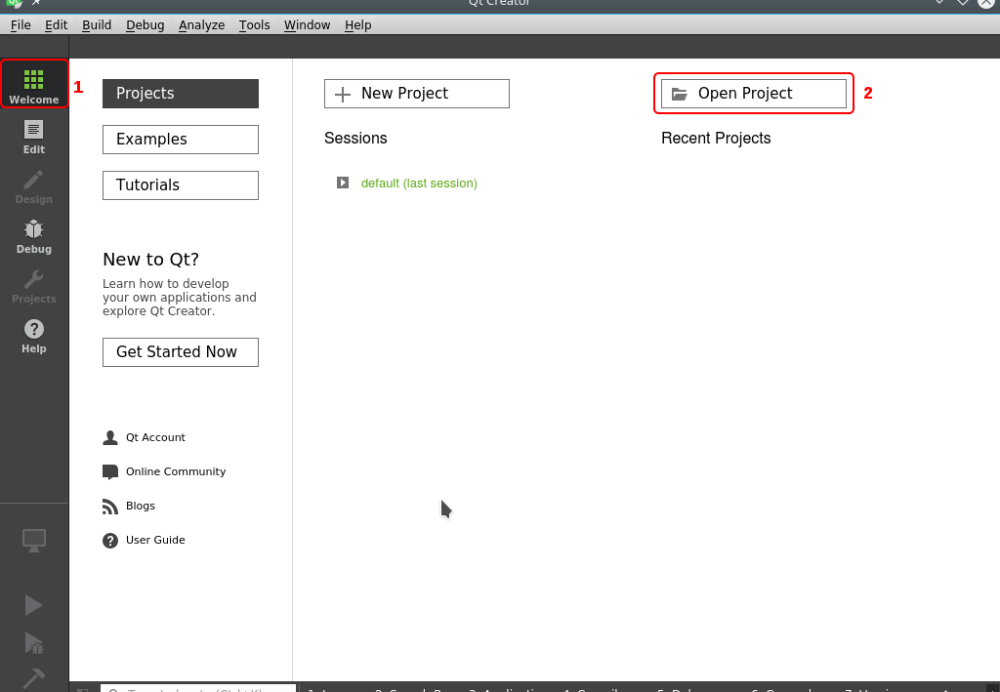
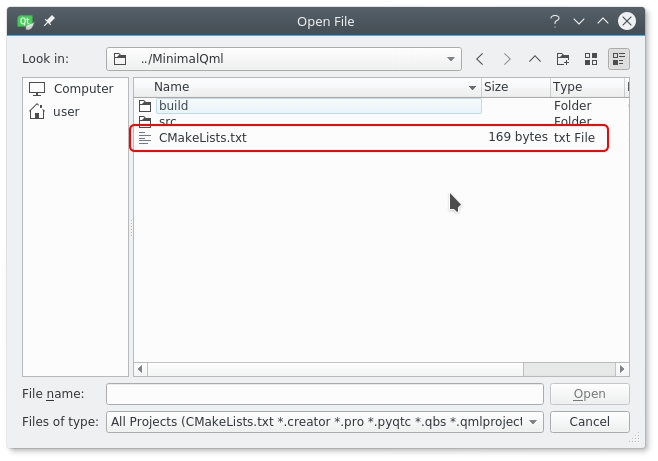
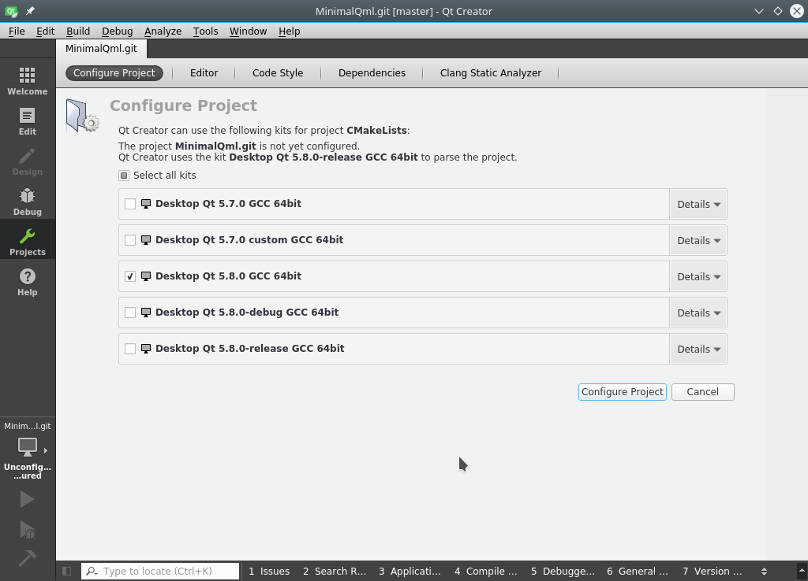
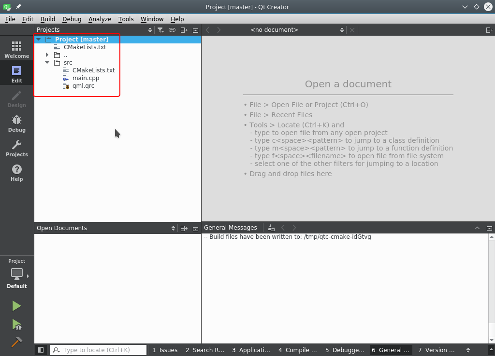
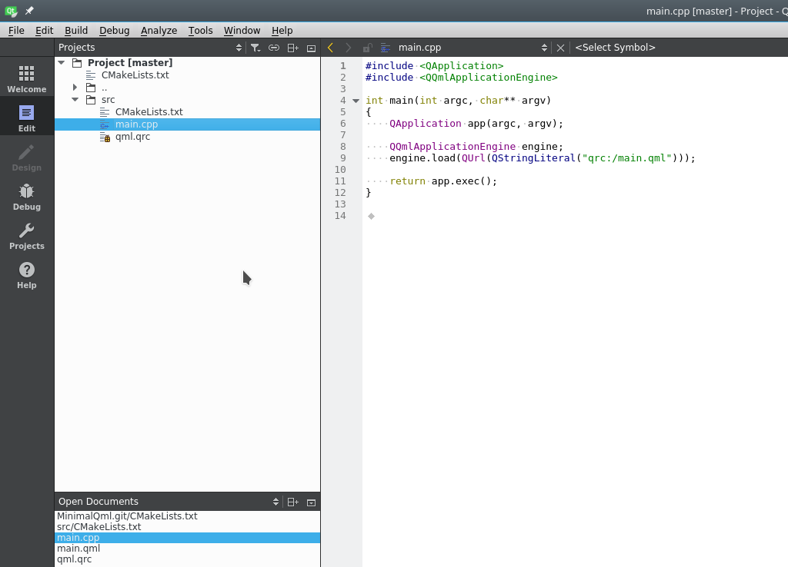
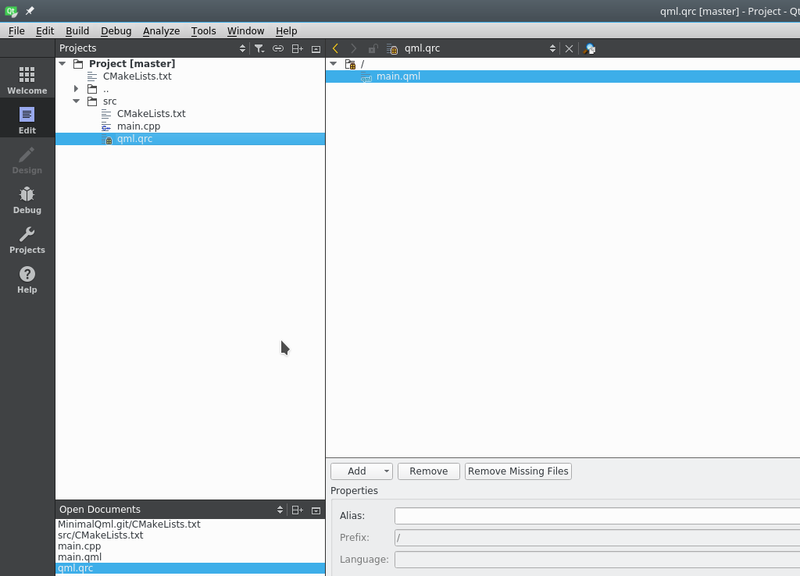
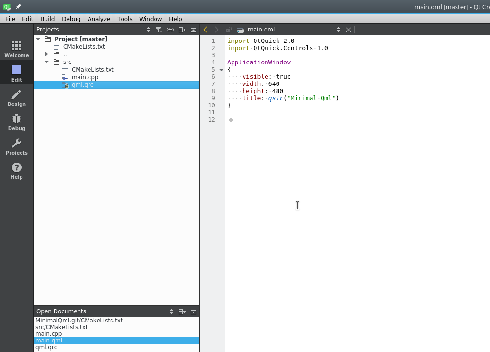

## Introduction

This guide aims to create a simple Qt application with Qt Quick graphical user 
interface. The tutorial uses CMake as the project format and C++ as the language 
of source code. The application created is simple in design and consists of sole 
window.

QtQuick is a user interface library for creating declarative
user interfaces that are separated from programming logic. This framework is
implemented as a part of the Qt library set. QML is a user interface 
specification and programming language.

CMake is the project generator for many platforms and build systems. The CMake build system uses  
the unified file format and is able to generate makefiles, Visual Studio 
solutions, and projects for many other build systems from the same project file.
You can check out some [CMake examples](https://cmake.org/examples/) on the official website if you want to learn more.

## Prerequisites

In order to develop an application using CMake with Qt QML,
we first need to make sure that we have all the necessary tools.

Compiling and running the sample project requires GCC, CMake, GNU Make and the Qt 
development libraries with Qt Quick enabled. This tutorial specifies how to 
install pre-compiled packages from standard repositories.

## Environment Setup

### Debian-based Systems

The following instructions apply to:

* Ubuntu 18.04
* Ubuntu 16.04
* Debian 9

```
sudo apt-get install -y \
    build-essential \
    cmake \
    qtbase5-dev \
    qtdeclarative5-dev \
    qml-module-qtquick2 \
    qml-module-qtquick-controls
```

### RedHat-based Systems

The following instructions apply to:

* Fedora 22 and higher

```
sudo dnf install -y \
    gcc gcc-c++ make \
    cmake \
    qt5-qtquickcontrols \
    qt5-qtbase-devel \
    qt5-qtdeclarative-devel \
    qt5-qtquickcontrols2-devel
```

* CentOS 7

```
sudo yum install -y \
    gcc gcc-c++ make \
    cmake \
    qt5-qtquickcontrols \
    qt5-qtbase-devel \
    qt5-qtdeclarative-devel \
    qt5-qtquickcontrols2-devel
```

## Directory Structure

The directory of the project is laid out as follows:

```
$ tree
.
├── CMakeLists.txt
└── src
    ├── CMakeLists.txt
    ├── main.cpp
    ├── main.qml
    └── qml.qrc
 
1 directory, 5 files
```

All source files for the project go in `src`, and main project specifications 
in CMake format go in `CMakeLists.txt`. Larger projects tend to be 
organised in sub-directories for modules, executables and libraries, each with 
its individual sub-directory and `CMakeLists.txt` file.

## Main Window GUI File

With this example, we start with the declarative file for the user interface, which is specified in 
`src/main.qml`. The code below creates a small window without any controls:

[src/main.qml](src/main.qml)

The next code imports all necessary modules. The exact version of `QtQuick` is not 
the same as the version of the Qt framework used. `QtQuick.Controls` library 
contains some basic controls for the user interface.

```
import QtQuick 2.0
import QtQuick.Controls 1.0
```

Main application window is represented with the `ApplicationWindow` control in the 
Qt Quick library. 

```
ApplicationWindow
{
...
}
```

There are four attributes of the main window that specify its size and title. 
The `visible` aattribute specifies that the window should
be shown right after launch.

```
visible: true
width: 640
height: 480
title: qsTr("Minimal Qml")
```

## QML Resource File

Next, let’s look at the QML resource file for an application that consists of sole QML file 
named `main.qml`. The file is written in XML with the `RCC` element as root and `qresource` as 
the element for group of resources. This project contains only one group that's
root (i.e. `/`). Larger projects may contain additional `qresource` elements for 
each resource subgroup (e.g. `customControls`, `customWindows`, etc.).

[src/qml.qrc](src/qml.qrc)

## Application Code

The main entry point of the application provides the C++ code for displaying Qt 
Quick user interface.

[src/main.qml](src/main.cpp)

The following code constructs a standard object for a Qt application:

```
QApplication app(argc, argv);
```

In the next section, the QML parsing object is initiated for the application. This object 
receives the string with the address of the main QML resource as the construction 
parameter. In this case, `qrc:/main.qml` is the address specified in the `qml.qrc` 
file. `qrc` is the default prefix for the QML resource, and `/main.qml` references the 
resource named `main.qml` in the root resource directory (`/`).

```
QQmlApplicationEngine engine;
engine.load(QUrl(QStringLiteral("qrc:/main.qml")));
```

The `exec` method starts the Qt application:

```
return app.exec();
```

## Project Files

Now we’ll show you how to deploy a Qt Quick application using the CMake project
format.

Let’s look at the main project file. The first line sets the minimum version of CMake 
for the project. It then includes the Qt5 framework into the application 
as well as the `src` subdirectory so that CMake will search 
for the project file (`CMakeLists.txt`) there.

[CMakeLists.txt](CMakeLists.txt)

This is the project file for the executable:

[src/CMakeLists.txt](src/CMakeLists.txt)

The header files of the Qt project should be included into the project so that the
makefiles generated will specify them in the corresponding compilation 
commands. There Qt5Widgets stands the header files for the Qt Framework and 
QtQml invokes special files for QML functions.

```
include_directories(${Qt5Widgets_INCLUDE_DIRS} ${QtQml_INCLUDE_DIRS})
```

The definitions as well as the Qt include files should be specified in the makefile 
compilation commands.

```
add_definitions(${Qt5Widgets_DEFINITIONS} ${QtQml_DEFINITIONS}
                ${${Qt5Quick_DEFINITIONS}})
```

The Qt framework requires the code to be created from the Qt resource files. 
This is achieved using the special `qt5_add_resources` command. The QML resource 
file path relative to this file is passed as an argument:

```
qt5_add_resources(QT_RESOURCES qml.qrc)
```

For Qt projects with graphical user interface, the compiler should receive 
special parameters in order to compile:

```
set(CMAKE_CXX_FLAGS "${CMAKE_CXX_FLAGS} ${Qt5Widgets_EXECUTABLE_COMPILE_FLAGS}")
```

Qt programs require several additional compilation steps for [moc](https://doc.qt.io/qt-5/moc.html),
[rcc](https://doc.qt.io/qt-5/rcc.html) and [uic](https://doc.qt.io/qt-5/uic.html). 

```
set(CMAKE_AUTOMOC ON)
set(CMAKE_AUTORCC ON)
set(CMAKE_AUTOUIC ON)
```

The name of the project that will be used as the name of the compiled executable,
is specified using the `set` command, which receives the name of a variable (i.e. 
`PROJECT`) and it's value.

```
set(PROJECT "MinimalQml")
```

The `project` command sets the current project within the CMake file and receives 
the value of the variable defined above:

```
project(${PROJECT})
```

The compiler flags for compiling C++ sources are set below. These flags set 
very strict compilation rules and help to detect and locate a lot of 
potential issues during compilation.

```
set(CMAKE_CXX_FLAGS "${CMAKE_CXX_FLAGS} -Wall -Werror -std=c++11 
    -fstrict-aliasing -pedantic-errors -pedantic -Wno-deprecated-declarations 
    -Wno-unused-variable")
```

There are also conditional commands in the CMake. The code below 
detects if there are `HEADERS` in the project. If the header files were not previously set, 
the `file(GLOB ... .h)` command creates a list of all header files in the 
current directory and passes them as header files of the current project. The 
same applies to the `.cpp` sources that are stored in the `SOURCES` variable if 
that was not defined.

```
if(NOT DEFINED HEADERS)
    file(GLOB HEADERS ${CMAKE_CURRENT_SOURCE_DIR}/*.h)
endif()
 
if(NOT DEFINED SOURCES)
    file(GLOB SOURCES ${CMAKE_CURRENT_SOURCE_DIR}/*.cpp)
endif()
```

The `source_group` definition creates a group of files that are placed in some 
build systems (e.g. project sub-directories in Visual Studio).

```
source_group("Header Files" FILES ${HEADERS})
source_group("Source Files" FILES ${SOURCES})
```

This command states that the project results in an executable file. The first 
parameter receives the name of an executable file (which in this case is the same as the name
of the project). The rest of the arguments are project sources, 
headers, and compiled Qt resources.

```
add_executable(${PROJECT} ${HEADERS} ${SOURCES} ${QT_RESOURCES})
```

The set of libraries that will be linked with the executable above is set with 
the `target_link_libraries` command. Like the command above, it receives the name 
of project's executable and a list of libraries. In this case, the project uses only
Qt framework libraries.

```
target_link_libraries(${PROJECT}
    Qt5::Widgets
    Qt5::Qml
    Qt5::Quick
    )
```

## Building Project

Now it’s time for building with CMake.

You can build your program using the commands below. CMake takes a directory 
with the main project's `CMakeLists.txt` file as an argument. Then it 
creates build files for GNU make, which builds an executable.

```
cd <PathToProject>
mkdir build && cd build
cmake ..
make
```

After a successful build, the binary `MinimalQml` will end up in `build/src/`.

```
./src/MinimalQml
```

## Working on a Project with Qt Creator

You can probably avoid working with Qt Creator by creating a Qt QML C++ plugin with CMake,
but we prefer going the traditional route.

If you want to know more about Qt Creator, you can find the [official manual](http://doc.qt.io/qtcreator/).
Now, let’s look into how we can use Qt Creator with our Qt CMake example project.

Go to the *Welcome* tab *(1)* in the main window and select *Open Project* *(2)*.



In the dialog box that opens, locate the `CMakeLists.txt` file in the project’s root directory.



Next, select the version of *Qt framework* that you’ll use to 
compile the project. If you have multiple frameworks installed,
it’s possible to select several.



After opening the project its directory structure will be visible in the *Projects* 
panel in Qt Creator.



The C++ source files are treated as usual by the editor.



QRC resource files are opened as a resource tree.



From the resource tree, you can open QML files for the project.



## Links

* Qt Documentation 
  * [Qt QML](https://doc.qt.io/qt-5/qtqml-index.html)
  * [Qt Quick](https://doc.qt.io/qt-5/qtquick-index.html)
  * [QML Applications](https://doc.qt.io/qt-5/qmlapplications.html)
* CMake
  * [CMake Documentation](https://cmake.org/documentation/)
  * [CMake Tutorial](https://cmake.org/cmake-tutorial/)

